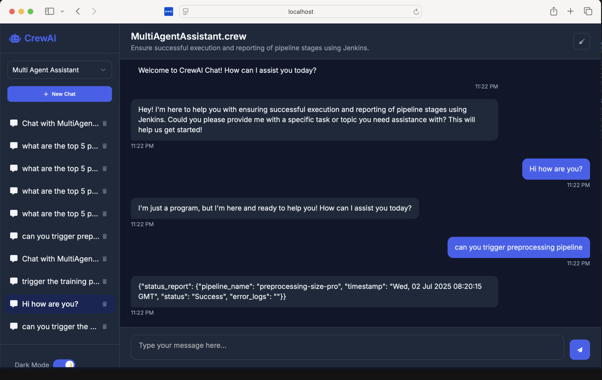

# MultiAgentAssistant Crew

Welcome to the MultiAgentAssistant Crew project, powered by [crewAI](https://crewai.com). This template enables you to set up a multi-agent AI system that collaborates on complex tasks. It also supports triggering Jenkins pipelines based on user input through natural language.

## Demo



## Key Features

- Multi-agent orchestration using [crewAI](https://crewai.com)
- YAML-based configuration for agents and tasks
- Easily extensible logic and tool integration
- Natural language-driven Jenkins pipeline triggering
- Generates markdown reports as output

## Installation

Ensure you have Python version >=3.10 and <3.14 installed.

This project uses [UV](https://docs.astral.sh/uv/) for dependency management.

### Step 1: Install UV

```bash
pip install uv
```

### Step 2: Install Project Dependencies

From the root of your project, run:

```bash
crewai install
```

### Step 3: Environment Setup

Create a .env file in the root directory with your credentials.

Example:

```bash
OPENAI_API_KEY=your_openai_api_key
JENKINS_URL=http://your-jenkins-server
JENKINS_USER=your_jenkins_username
JENKINS_API_TOKEN=your_jenkins_api_token
```

#### Customization
You can customize agents, tasks, and logic using the following files:


#### Running the Project
To start your AI agents and execute tasks, run:
```bash
crewai run
```
```bash
crewai-chat-ui
```

By default, this creates a report.md file with a summary of research on LLMs.

#### Jenkins Integration
This project allows you to trigger Jenkins pipelines using natural language input.

#### Example Prompts
```bash
"Trigger the deployment pipeline"
"Run the data ingestion job"
"Start the nightly build"
```
̵̵̵

## About Me
I am Yash Gupta, a data scientist passionate about building AI systems that are modular, automated, and production-ready. This project reflects my exploration of intelligent agents that can communicate, delegate, and automate real-world tasks like triggering CI/CD pipelines.

Feel free to connect with me:
LinkedIn: https://www.linkedin.com/in/eryash15
